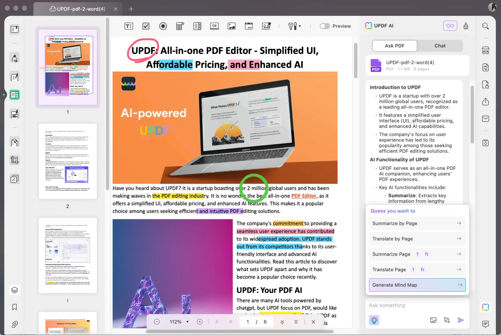
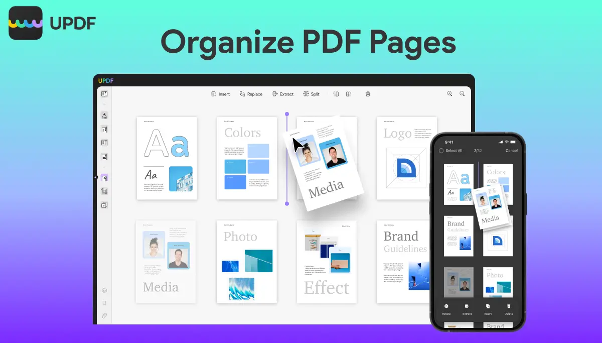
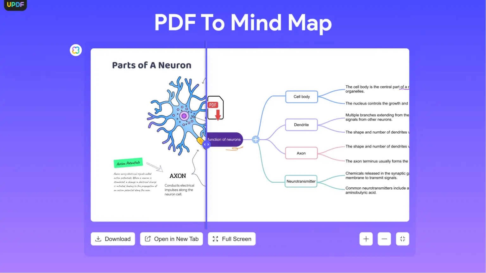
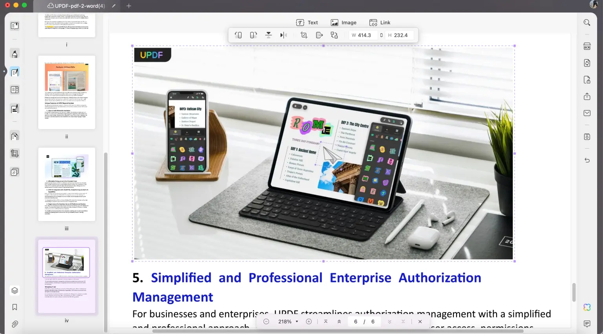
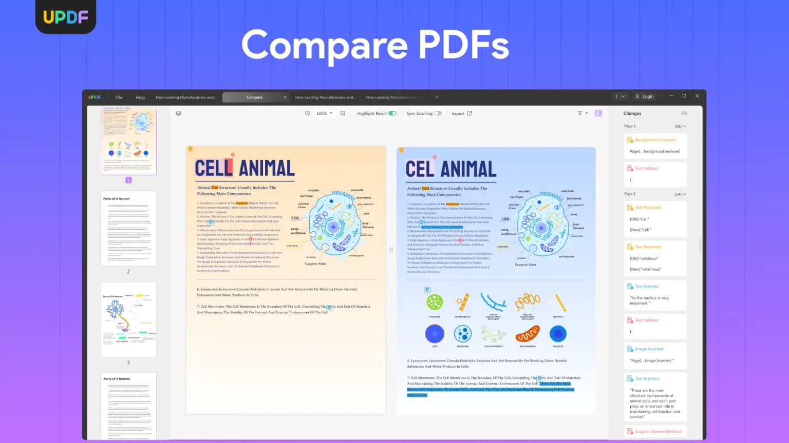

As AI becomes an integral part of our daily routines and Apple steps into the AI arena with Apple Intelligence, the demand for smarter, more efficient tools is on the rise. Managing vast amounts of data, particularly in PDFs, requires a solution that not only enhances productivity but also integrates seamlessly with the Apple ecosystem. Introducing UPDF – the AI-driven PDF editor designed specifically for Apple users. Whether it's effortless annotation or converting PDFs into mind maps, UPDF is the comprehensive solution that Apple enthusiasts have been anticipating.

[https://youtube.com/FHYU1GTxYdE](https://youtube.com/FHYU1GTxYdE)

### The Ultimate PDF Solution for iOS, iPad, and macOS

UPDF brings powerful AI capabilities to PDF editing, making it effortless on your Mac, iPhone, and iPad. Whether you’re looking to edit, annotate, convert, or even chat with your PDFs, UPDF streamlines your workflow with ease.

More than just a PDF editor, UPDF is crafted to simplify your life, offering professional-grade tools in an incredibly user-friendly package. Here are some standout features of UPDF:

### Seamless PDF editing & annotation
Whether you’re making small edits or adding detailed notes, UPDF offers smooth editing tools: edit and delete PDF text, images, and URLs. It’s packed with 100+ annotation stickers, responsive drawing tools, and a lifelike pencil for precision.

### Effortless PDF Page Management and doc conversion
The visually intuitive layout facilitates seamless dragging and cropping. You can effortlessly add, delete, rotate, replace, extract, split, crop, and rearrange PDF pages!

### High-quality PDF document conversion
PDF to Word, Excel, PPT, etc. UPDF ensures that the page content is not lost or omitted, with a very accurate restoration of fonts, sizes, and colours. The OCR feature can also convert scanned PDFs into editable text in any language.

### Powerful AI: Convert PDF to Mind Map
Combining ChatGPT 4.0 with UPDF AI not only offers powerful features for summarizing, translating, and explaining PDFs, but one of UPDF’s standout features is its ability to convert PDFs into mind maps, allowing you to visualize content and better organize ideas. This feature is perfect for students tackling dense reading material, professionals organizing research, or creatives brainstorming ideas. It’s the first PDF tool with this functionality, helping you turn information overload into structured insights.

### Form Filling and Signing

UPDF enables users to easily fill out and manage PDF forms. The form field recognition feature streamlines the process, allowing professionals to create and complete forms with efficiency. You can sign PDFs on any device and synchronize your changes seamlessly.

In addition to the features mentioned above, UPDF also offers a variety of excellent PDF tools, such as compression, password protection, redaction, digital signing, and batch processing of PDFs.

### UPDF vs the competition

UPDF offers all the premium features of its competitors but at a quarter of the price. This powerful tool ensures that users can edit, annotate, convert, and manage their PDF documents with ease. With its user-friendly interface and robust functionality, UPDF caters to both individual and business needs, making it an ideal choice for anyone looking to optimize their document workflows without breaking the bank.

### Here’s why UPDF outshines the rest:

**Cost-Effective**: It’s priced at a fraction of competitors but without compromising on features.

**Lightweight, clean UI**: The clean, intuitive design ensures you can navigate your work without distractions.

**Multi-platform support**: One account works across your Mac, iPhone, and iPad. Plus, it supports multiple tabs for multitasking like a pro.

**Massive cloud storage**: With up to 110 GB of cloud storage, you can securely store and access your files from any device.

**Reliable Customer Support**: With 24/6 customer service, you’ll always have help when you need it.

**Enterprise-Ready**: Need licensing for your whole team? UPDF offers flexible enterprise licensing with AI support.

**Integrated with ChatGPT**: UPDF is one of the first PDF editors to offer ChatGPT integration, making AI-powered document editing and interaction effortless.

**Chat with image**: Another groundbreaking feature of UPDF is its ability to “chat” with images within your PDFs. This function opens new possibilities for engaging with visual content in ways that traditional PDF editors simply can’t match.
Frequent updates keep UPDF fresh and continually improving, giving you access to the latest features and performance enhancements.

### Additional features UPDF brings to the table

UPDF is equipped with a wide array of features designed for every kind of user, from casual PDF readers to professionals. Here are some of the latest features and updates:

**Compare PDFs**: This new feature lets Apple users compare documents, easily spotting differences between versions.

**Customizable bookmarks**: Personalize your PDF experience by customizing the bookmarks’ appearance, including text colour, bold, and italics.

**UPDF cloud management**: Manage all your shared files through UPDF’s cloud for a seamless experience.

UPDF offers everything you need for top-tier PDF management, ensuring that you can handle any PDF-related task with ease.

### Pricing and availability

UPDF offers two main pricing plans. The [UPDF Pro Plan](https://bit.ly/3Mv3KHF) is a one-time purchase at $59.99 (regularly $79.99), giving you full access to PDF editing tools across Mac, iOS, Android, and Windows. This plan includes 100GB of cloud storage for secure, multi-device access.

For AI features, the [UPDF AI Assistant Plan](https://bit.ly/3Mv3KHF) is $69.00 per year, with a 7-day free trial. This plan unlocks AI-powered tools like chatting with PDFs, images, and converting PDFs into mind maps, all supported across four devices. It also includes 100GB of cloud storage and is auto-renewed yearly with the option to cancel anytime.
