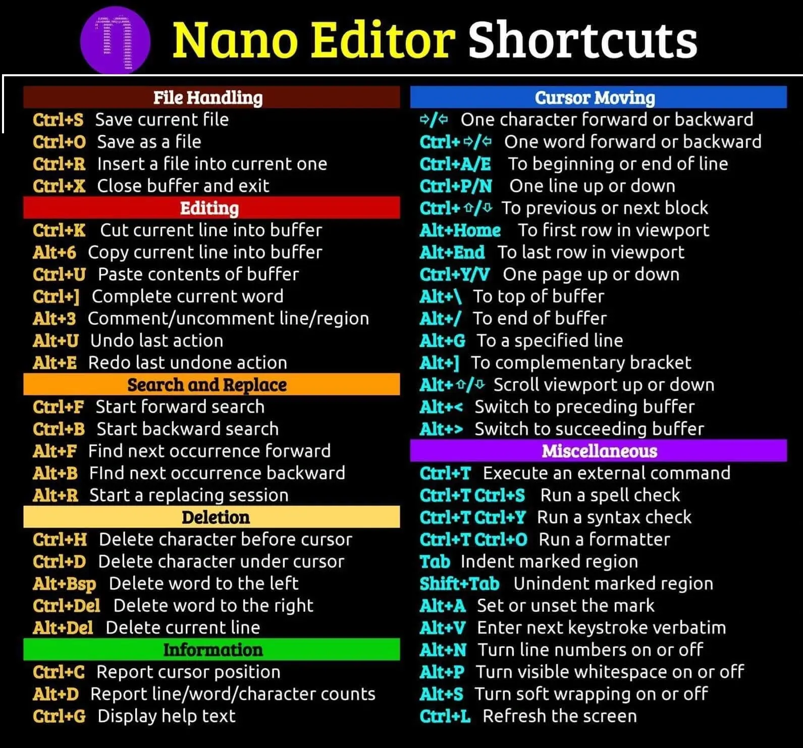

You will learn how to use and install Nano, a popular text editor for Unix and Linux operating systems. Nano comes with many powerful features and allows you to edit and create various files on your computer or server. So, let’s get right to it.

Command Explanation:
* Command: CTRL + A
  * Explanation: This lets you jump to the beginning of the line.
* Command: CTRL + E
  * Explanation: Let you jump to the end of the line.
* Command: CTRL + Y
  * Explanation: Scrolls page up.
* Command: CTRL + V
  * Explanation: Scrolls page down.
* Command: CTRL + G
  * Explanation: A Help window will pop up and show you all the available commands.
* Command: CTRL + O
  * Explanation: To save the file. Nano will ask you to edit or verify the desired file name.
* Command: CTRL + W
  * Explanation: Search for a specified phrase in your text. Press ALT + W to search for the same phrase again.
* Command: CTRL + K
  * Explanation: It cuts the entire selected line to the cut buffer (similar to a clipboard).
* Command: CTRL + U
  * Explanation: To paste the text from the cut buffer into the selected line.
* Command: CTRL + J
  * Explanation: Justify the current paragraph.
* Command: CTRL + C
  * Explanation: Shows the current cursor position in the text (line/column/character).
* Command: CTRL + R
  * Explanation: Opens a file and inserts it at the current cursor position.
* Command: CTRL + X
  * Explanation: To exit the Nano text editor. It prompts a save request if you made any changes to the file.
* Command: CTRL + \
  * Explanation: Replaces string or a regular expression.
* Command: CTRL + T
  * Explanation: Invokes the spell checker, if available.
* Command: CTRL + _
  * Explanation: Let you go to the specified line and column number.
* Command: ALT + A
  * Explanation: To select text. You can combine this command with CTRL + K to cut a specific part of the text to the cut buffer.
